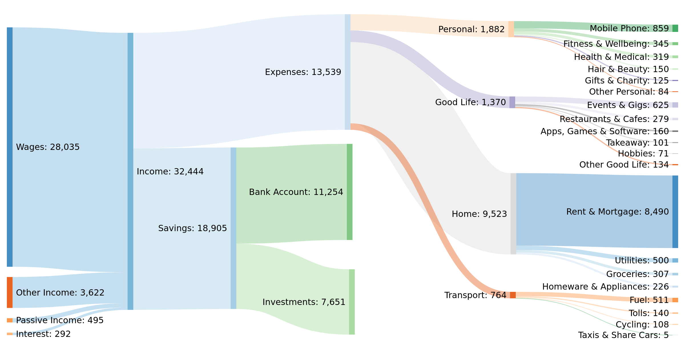

# Up Bankey
This is a configurable Sankey diagram generator for summarising the flow in your finances, integrated with [Up Bank](https://up.com.au/) using the [Up Bank API](https://developer.up.com.au/) and [Sankeymatic](https://sankeymatic.com/).




## Installation

1. Clone this repository.

   

2. Install dependencies.

   

3. Set up an Up API personal access token.

   To interface with the Up API, you will need a personal access token (PAT). You can find instructions for how to retrieve one [here](https://developer.up.com.au/#getting-started). The recommended location for storing your PAT is in an environment variable `UP_TOKEN`, however this can be modified using the [`token` configuration option](#token).

4. Run `python main.py`.


## Usage

The current state of this generator collates the data into an output usable by [SankeyMatic](https://sankeymatic.com/). 

To visualise the data, copy the text from `results.txt` into the inputs textbox and click on `Preview`. You can find instructions on how to use `SankeyMatic` [here](https://sankeymatic.com/manual/).

To add a custom configuration, create a copy of `example.yaml` in the `config` folder and run

​	`python main.py --config <your-config>.yaml` 


## Configuration

A number of configuration options are available to help improve how transactions are categorised. An example for these can be found in `config/example.yaml`. All configuration items are optional and will revert to the defaults in `src/config.py` if unspecified.

### `options`

#### `output`

The path and filename to direct the results towards. The path can be absolute or relative to the git repository.

#### `dates`

The start and end date for all transactions that are to be tracked.

#### `sources`

##### `up-api`

###### `token`

###### `limit`

###### `pagesize`

### `collections`

#### `income/expenses/savings`

##### `name`

An alternative name in case you dislike the naming convention of Income, Expenses and Savings.

##### `classifiers`

If a transaction matches any of these characteristics, then they are put into this transaction collection.

Optionally, you can specify an alternative name for transactions that are categorised this way:

```yaml
accounts:
  - Job 1 : Wages
```

###### `accounts`

A list of payees. All transactions from these payees will go into this transaction collection. For example, you can specify that all transactions from account "X" are wages and so should be classed as income.

###### `tags`

A list of tags. All transactions with these tags will go into this transaction collection.

Transactions are categorised by tags first, then by account.

##### `threshold`

Too many transaction categories makes for a diagram that is difficult to read. These options provide different ways in which the number of transaction categories can be limited. All groups that fall under these limits are put into a separate category called "Other <name>", where <name> can be specified above.

###### `count`

A limit to the number of different categories that can fit in a given transaction collection.

###### `value`

A limit to the total value of a category. Any categories that have a total less than this value are grouped together.

###### `percentage`

A limit to the relative value of a category, compared with the total of the collection. All categories that have a total value that is smaller than this percentage relative to the collection total are grouped together.

#### `ignore` 

Sometimes there are transactions that just don't have a sensible location in your diagram. These are classified in much the same way as the transaction collections above. See information on the [`classifiers` configuration](#classifiers) for more details. 

Ignored transactions take precedence over any of the transaction collections. If a transaction could be classified both as an ignored transaction and as any other transaction, then that transaction will be ignored.
